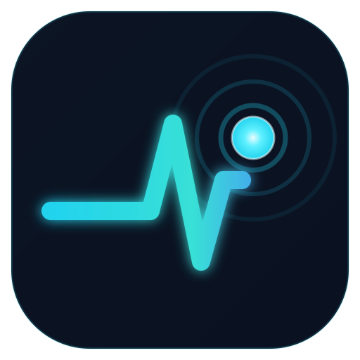

# Net Pulse — Open Net Tools

<p align="center"></p>

> **Running the app:** Net Pulse is an **Electron desktop app**. Run it from a
> terminal, **not** from VS Code's C++ *Debug/Play* button.
>
> One-shot: **`./build-and-run.ps1`** (Windows) or **`./build-and-run.sh`**
> (Linux/macOS) from the project root. For real ICMP probing, use an
> **Administrator** terminal (Windows) or grant `cap_net_raw` (Linux).
>
> **In VS Code:** open the Run and Debug panel (Ctrl+Shift+D) and pick
> **"Net Pulse: Launch app (Electron)"** from the dropdown, then press ▶. This
> builds everything and launches the real app. Do **not** use the default C++
> "Debug"/▶ button in the status bar — CMake Tools auto-selects
> `netpulse_tests` as its target (the only executable this CMake project
> builds), so that button runs the **unit tests**, not the app. If you see it
> print `ALL TESTS PASSED` and exit with code `0`, that is a passing test
> suite, not a crash — exit code 0 means success on every OS.
>
> **The C++ CMake project is NOT the app.** It builds only the engine library
> (`netpulse_core`) and its unit tests (`netpulse_tests`). If you press VS Code's
> Debug button it will build and run `netpulse_tests.exe`, which prints
> `ALL TESTS PASSED` and exits with code 0. A console test finishing and closing
> its window in a flash is **success, not a crash** — that's the tests doing
> their job. The actual app lives in `electron/` + `napi/` (below).


A cross-platform **desktop** path-latency monitor (PingPlotter / mtr style):
continuous per-hop ping + traceroute, IPv4 **and** IPv6, multiple targets, live
config, per-hop ASN/BGP, alerts, exports, light & dark themes.

Each target in the sidebar shows a **two-lamp status signal** (target + path) —
see [Status lamps](#status-lamps) below for what the colours mean.

Net Pulse — Open Net Tools is a **native desktop app** — Electron shell + a C++ engine compiled as
an in-process **Node-API addon**. There is **no web server, no localhost port,
and no WebSocket**. The renderer talks to the engine only over Electron IPC,
exactly like a Qt app talks to its backend.

```
┌─────────────────────────────────────────────┐
│ Electron renderer (React UI, web/dist)        │  file://  — no HTTP
│   window.netpulse.*  ──IPC──┐                 │
├─────────────────────────────┼─────────────────┤
│ Electron main (main.js)     ▼                 │
│   require('../napi')  →  netpulse.node         │  in-process
├───────────────────────────────────────────────┤
│ C++ engine (core/)  — ICMP codec, transport,   │  background threads
│ continuous probing, per-hop stats, JSON state  │  raw sockets
└───────────────────────────────────────────────┘
```

## Layout

| Path        | What                                                                 |
|-------------|----------------------------------------------------------------------|
| `core/`     | The engine (header-only API in `core/include/netpulse/`). Pure C++17. |
| `napi/`     | Node-API addon (CMake.js) wrapping the engine. Builds `netpulse.node`. |
| `electron/` | Desktop shell: `main.js` (loads the addon, IPC), `preload.js`.         |
| `web/`      | React renderer (Vite). Built to `web/dist`, loaded over `file://`.     |
| `tests/`    | C++ unit tests for the engine.                                        |
| `CMakeLists.txt` | Builds the core library + unit tests (for engine development).   |

## Prerequisites

- **Node.js** 18+ and npm
- **CMake** 3.15+ on your **PATH** — CMake.js does *not* bundle it.
  - Easiest: install from <https://cmake.org/download/> and tick **"Add CMake to
    the system PATH"**, then open a **new** terminal and check `cmake --version`.
  - Or use the CMake that ships with Visual Studio by launching
    **"Developer PowerShell for VS"** (it puts VS's CMake on PATH).
- A **C++17 compiler**
  - Windows: Visual Studio Build Tools / VS 2022+ — *"Desktop development with C++"*
  - Linux: `build-essential`; macOS: Xcode command-line tools
- The addon is built with **CMake.js**, so it is **independent of the Node.js
  version** (and rebuildable for Electron's ABI).

> `npm install` in `napi/` only fetches dependencies — it does **not** build the
> addon. You build it explicitly (below), after CMake is on your PATH.

## Build & run

### 1. Native engine (Node-API addon)

```bash
cd napi
npm install                  # fetches node-addon-api + cmake-js (no build yet)
npm run build:electron       # builds netpulse.node for Electron's ABI
# (or `npm run build` to build for plain Node, e.g. for the test in index.js)
```

`build:electron` pins Electron 29.1.0; if you use a different Electron, run:
`npx cmake-js compile --runtime electron --runtime-version <your version>`.

### 2. Renderer

```bash
cd web
npm install
npm run build          # → web/dist (assets are relative, for file:// loading)
```

### 3. Desktop app

```bash
cd electron
npm install            # electron
npm start              # launches the app (loads the addon; no server/port)
```

Dev mode (hot-reload UI from Vite while still using the native engine):

```bash
# terminal 1
cd web && npm run dev          # vite on :5173 (UI only — no /api server)
# terminal 2
cd electron && npm run dev     # NETPULSE_DEV=1 electron .  (loads :5173 + addon)
```

### Raw sockets / privileges

ICMP probing needs raw-socket privileges:

- **Windows:** run the app **as Administrator**.
- **Linux:** either run elevated, or grant the capability once:
  `sudo setcap cap_net_raw+ep $(which electron)` (or the packaged binary).
  Alternatively use **unprivileged datagram ICMP** by unchecking **Raw** when
  adding a target (works without admin on most Linux/macOS for plain ping).

## Troubleshooting (Windows)

**`cmake-js` → "CMake is not installed. Install CMake."**
CMake.js found Visual Studio but not a `cmake` executable. Install CMake and add
it to PATH (or use *Developer PowerShell for VS*), open a new terminal, confirm
`cmake --version`, then `cd napi && npm run build:electron`. Note `npm install`
no longer triggers the build, so a missing CMake won't break `npm i`.

**`npm i` in `electron/` → `EBUSY: resource busy or locked … default_app.asar`**
A file lock during Electron's unpack — almost always because the project is in
**`Downloads`/OneDrive** (sync + antivirus lock files mid-rename) or an Electron
process is still running. Fix:
1. Move the project out of `Downloads` to a non-synced path, e.g. `C:\dev\NetPulse`.
2. Close any running `electron.exe`/`node.exe` (Task Manager).
3. `rmdir /s /q electron\node_modules` and `npm cache clean --force`.
4. (Optional) pause OneDrive sync / add a Defender exclusion for the folder.
5. Retry `npm install`.

## Engine development (no Node needed)

```bash
cmake -S . -B build
cmake --build build
ctest --test-dir build      # runs the C++ unit tests
```

## Packaging (electron-builder, sketch)

Bundle `web/dist`, the Electron files, and the **Electron-ABI** addon
(`napi/build/Release/netpulse.node` + `napi/index.js`). Mark `napi` as
`asarUnpack` so the `.node` can be `dlopen`ed:

```jsonc
"build": {
  "files": ["electron/**", "web/dist/**", "napi/index.js"],
  "asarUnpack": ["napi/**"],
  "extraResources": ["napi/build/Release/netpulse.node"]
}
```

## Security

- **No network surface from the app itself.** No HTTP server, no open port, no
  WebSocket — the only sockets opened are the ICMP probe sockets.
- **Hardened renderer:** `contextIsolation: true`, `nodeIntegration: false`,
  `sandbox: true`. The renderer reaches the engine only through a minimal,
  audited IPC surface exposed by `preload.js` as `window.netpulse`.
- **Content-Security-Policy** is set in the main process: `default-src 'self'`,
  `script-src 'self'` (no remote scripts, no `eval`), `connect-src 'self'
  https:` (only for the optional BGP/RDAP/DoH lookups), `object-src 'none'`.
- **In-app navigation is blocked**; external links (looking-glass, PeeringDB,
  RIPEstat) open in the OS browser.
- **Addon input validation:** every value crossing the JS↔C++ boundary is
  range-clamped (probe 0.01–3600 s, timeout 0–3600 s, payload 0–1472 B,
  max-hops 1–64) and the target string is length-checked; bad input throws a JS
  error instead of reaching the engine. No shell is ever invoked, so there is no
  command-injection surface.
- Native-addon guidance followed per
  <https://snyk.io/blog/nodejs-add-on-extensions/> (validate at the boundary,
  no untrusted input to native parsing, keep the C++ surface small).

## Status lamps

Each target in the sidebar shows a **two-lamp signal**, read together like a
German railway *Hauptsignal* — the meaning comes from both lamps, not one
blended colour. The **left lamp is the target** (the destination's own health);
the **right lamp is the path** (the route/intermediate hops leading to it). This
separates "the destination is slow/lossy" from "something upstream on the route
is misbehaving", so you can tell at a glance *which* is the problem.

**Target lamp** (destination health), graduated by latency and loss:

| Colour | Meaning |
|--------|---------|
| 🟢 green | Healthy — low latency, no loss. |
| 🟩 lime *(pulsing)* | Healthy, but the route or latency baseline **changed recently** (e.g. the destination's IP moved to a different path / load-balancer, or the median RTT shifted) — shown until it re-stabilises (timer). |
| 🟡 yellow | Elevated — latency ≥ 70 ms **or** packet loss > 5%. |
| 🟠 orange | Degraded — latency ≥ 100 ms **or** packet loss > 10%. |
| 🔴 red | Unreachable, **or** latency ≥ 150 ms, **or** loss > 20%, **or** latency fluctuating with ≥ 50 ms swings. |
| 🔵 cyan *(pulsing)* | Route discovery in progress (no confirmed destination yet). |

**Path lamp** (route health):

| Colour | Meaning |
|--------|---------|
| 🟢 green | Packets routing cleanly to the target. |
| 🟡 yellow | An intermediate hop is dropping packets **or** not revealing itself (a `*`/silent router — often normal, as routers deprioritise ICMP to themselves). |
| 🟠 orange | Packets are routing toward the target pool (via BGP) but the target or some router is **dropping** them. |
| 🔴 red | No route — internet/interface down, RTO, or the first hop is rejecting. |
| 🔵 cyan *(pulsing)* | Route discovery in progress. |

The exact thresholds live in the `LAMP` object in `web/src/App.jsx`
(`destLamp` / `pathLamp`); the colours are CSS-variable-driven in
`web/src/styles.css` (`.lamp.st-*`). These thresholds are deliberately separate
from the single `alerts.ms` / `alerts.loss` pair, which drives the per-hop table
highlighting and the "N hops with loss/latency" banner.

> **Note for maintainers:** the lamp classes are composed at runtime
> (`'st-' + state`), so they never appear as literal strings for Tailwind's
> content scanner. They are listed in `safelist` in `web/tailwind.config.js` —
> **any new lamp state must be added there**, or Tailwind's tree-shaker will
> silently drop its colour from the build.

## Route discovery

Discovery (finding the hops to the destination) and steady-state monitoring use
different send cadences, governed by two cooperating mechanisms in
`core/src/session.cpp`:

1. **Per-hop desired cadence.** Unanswered hops become due quickly
   (`kDiscoveryInterval`) so the route is found fast; answered hops fall back to
   the configured steady `interval`. Non-responding (`*`) hops back off after a
   few fast tries (`kDiscoveryTries`) so they don't hog the budget.
2. **A single global token-bucket rate limiter** (`kMaxProbeRate` /
   `kProbeBurst`) paces **all** ICMP sends into a smooth, low, constant stream.
   This is deliberate: fast raw-socket ICMP bursts to one address are exactly
   the pattern that behavioural AV, Windows Defender's network monitor, and
   Smart App Control flag as flooding/scanning. The bucket caps the aggregate
   send rate at or below the app's own steady all-hops rate, so discovery is
   quick **without** ever emitting a flood/scan signature.

Two related correctness details handled here: a reply that comes back **later
than its timeout** is rejected (treated as loss) rather than recorded as a giant
RTT — this prevents the "latency ramp" artifact when an edge briefly
rate-limits/queues ICMP. And any **EchoReply** is accepted as reaching the
destination even if its source address was rewritten by a NAT/load-balancer, so
discovery isn't stalled by address rewriting (the visible destination IP is
updated to the actual responder).

## Styling

The UI is built with **Tailwind CSS**, compiled at build time in `web/` via
PostCSS (`npm run build`). This has **zero effect on packaging**: the output
is one static `.css` file in `web/dist`, exactly like the hand-written CSS it
replaced — Tailwind never ships in the Electron bundle, only its compiled
output does. Theme colors (light/dark) are still driven by CSS variables in
`src/styles.css`, with Tailwind utilities reading from them, so the existing
`data-theme` toggle keeps working unchanged. No web fonts are bundled or
fetched — the UI uses the OS's system font stack, which keeps licensing and
the CSP (`connect-src 'self' https:`) simple.

## License

**GNU Affero General Public License v3.0 or later (AGPL-3.0-or-later)** — see
[`LICENSE`](LICENSE) and [`COPYRIGHT`](COPYRIGHT). Third-party components and
their licenses are listed in [`THIRD_PARTY_NOTICES.md`](THIRD_PARTY_NOTICES.md).

Net Pulse — Open Net Tools is copyleft, in the spirit of projects like VLC: it
is and stays open source. The AGPL additionally requires that if you run a
modified version as a **network service**, you must offer its users the
corresponding source. Contributions are welcome and expected to be under the
same license, keeping the project open for active community development.

"PingPlotter" and "mtr" are referenced only for behavioral comparison and are
trademarks of their respective owners; Net Pulse — Open Net Tools is an independent project.

## Tools (tabs)

The app is organized into tabs across the top:

- **Path / MTR** (home) — the live multi-target path-latency monitor.
- **Ping** — a single-host ping using the OS `ping`, streamed cmd-style.
- **DNS Lookup** — forward (A/AAAA/CNAME) and reverse (PTR) resolution.
- **Port Scanner** — a bounded TCP connect scan (≤ 2048 ports/scan). Only scan
  hosts you own or are authorized to test.

The Ping, DNS, and Port Scanner tools run in the desktop app (they use the OS
network stack via the Electron main process); they are unavailable in a plain
browser dev server.

